# JOAN SYLVESTER 

## About Me

I am a UI/UX Designer with a strong passion for creating intuitive and visually appealing user interfaces. With a solid understanding of user-centered design principles and industry trends, I aim to design and implement engaging digital experiences that meet the needs of the targeted audience. 

## Skills

- Design Tools: Figma, Adobe XD, Adobe Photoshop
- User Research: Methodologies, Usability Testing
- User-Centered Design: Processes, Principles
- HTML, CSS, Responsive Design (basic knowledge)

## Projects

### [Give a Meal Popup for 1 Billion Meals Campaign Page](https://www.figma.com/proto/l2n0IhKdIaxz76pRmoUdwV)

The One Billion Meals Popup is a call to action popup designed to encourage users visiting our 1 Billion Meals page on a mobile device to download our Give a Meal mobile app. The popup provides a visually appealing and user-friendly experience, promopting the user to take action.

[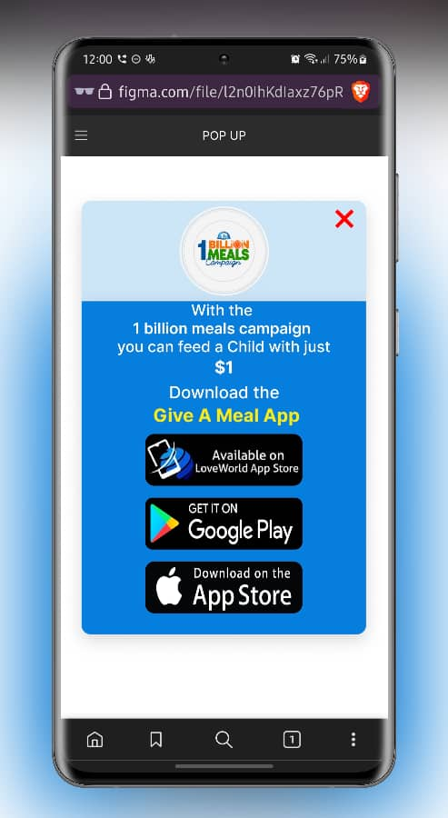](https://www.figma.com/proto/l2n0IhKdIaxz76pRmoUdwV/POP-UP?node-id=2-2&scaling=scale-down&hide-ui=1&t=aqct1y6T5NfrFtPY-8)

 Technologies/Tools Used: 
- Figma: Utilized for creating interactive prototypes and gathering feedback during the design process.
- Adobe Photoshop: Used for editing and optimizing images used in the popup.

Implementation: The Give a Meal Popup for the One Billion Meals Campaign can experienced by visiting [theinnercitymission.ngo/1billionmeals](https://theinnercitymission.ngo/1billionmeals) *on your mobile device*.

 

<!-- 
333333 get the link from joan 333333

### [Give a Meal Popup for HomePage](https://www.figma.com/proto/)

The Give a Meal Popup is a mobile-responsive call to action designed to inspire users who are browsing the InnerCity Mission website on their mobile devices to download our Give a Meal mobile app. This popup offers an attractive and intuitive interface that effectively prompts users to take action, enhancing user engagement and encouraging app downloads.

 Technologies/Tools Used: 
- Figma: Utilized for creating interactive prototypes and gathering feedback during the design process.
- Adobe Photoshop: Used for editing and optimizing images used in the popup.

Implementation: The Give a Meal Popup was implemented on the InnerCity Mission's landing page. You can experience it firsthand by visiting [theinnercitymission.ngo](https://theinnercitymission.ngo) *on your mobile device*. 
-->

### [Virtual Food Drive](https://www.figma.com/file/5zy3JtE2vdQhxzKVltSxVS)

**Description**

VFD Complete Flow is a comprehensive mobile responsive design for the Virtual Food Drive project. It includes mobile views for all pages and showcases the user flows within the application. The design aims to provide a seamless and intuitive user experience for participants in the Virtual Food Drive, promoting donations and engagement.

[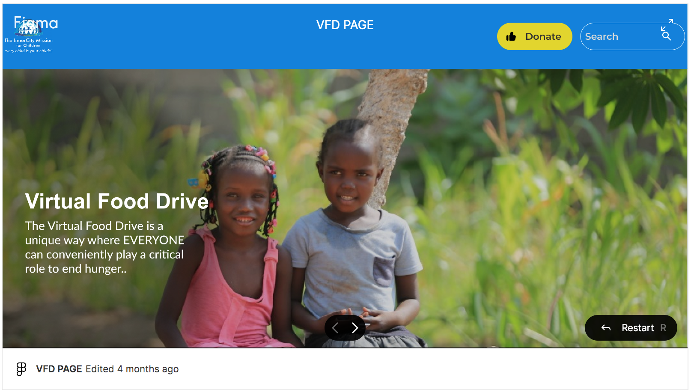](https://www.figma.com/proto/5zy3JtE2vdQhxzKVltSxVS/VFD-PAGE?node-id=6-13&starting-point-node-id=6%3A13&scaling=scale-down-width&hide-ui=1&t=EvWxnjyunDnn3c78-8)

<!-- 
<iframe style="border: 1px solid rgba(0, 0, 0, 0.1);" width="800" height="450"
    src="https://www.figma.com/embed?embed_host=share&url=https%3A%2F%2Fwww.figma.com%2Fproto%2F5zy3JtE2vdQhxzKVltSxVS%2FVFD-PAGE%3Fnode-id%3D6-13%26starting-point-node-id%3D6%253A13%26scaling%3Dscale-down-width%26mode%3Ddesign%26t%3DEvWxnjyunDnn3c78-1"
    allowfullscreen></iframe>
 -->

**Technologies/Tools Used:**

- Figma: Utilized for creating interactive prototypes and gathering feedback during the design process.
- Adobe Photoshop: Used for editing and optimizing images used throughout the design.

**Implementation:** 

The Virtual Food Drive was implemented in [vfd.theinnercitymission.tv](https://vfd.theinnercitymission.tv), which is the Virtual Food Drive website.

 

### [360° Virtual Tour](https://www.figma.com/file/poggsGb19jK5v309aAdAG4)

**Description**

The 360° Virtual Tour webpage for InnerCity Mission Schools serves as an immersive platform for visitors to virtually explore the schools and gain insights into their mission and impact. The tour offers a glimpse into the InnerCity Mission network of schools in Ikeja, Shimawa, and Taraba, which offers free education and daily meals for children in need. Through my UI/UX design, I aimed to create an engaging and user-friendly experience that effectively communicates the mission and values of InnerCity Mission Schools.

[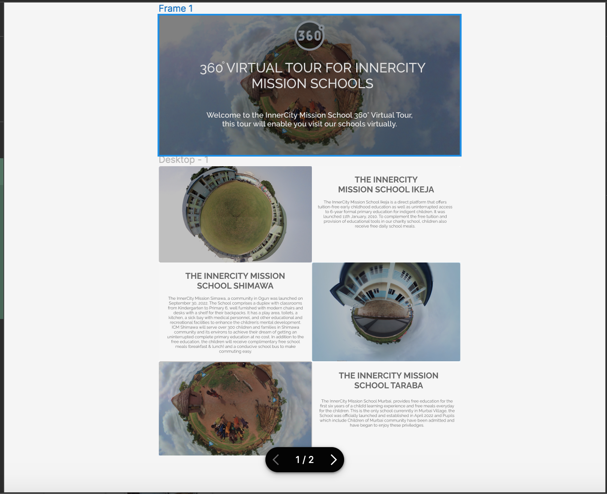](https://www.figma.com/proto/poggsGb19jK5v309aAdAG4/Untitled?node-id=1-32&scaling=scale-down&hide-ui=1)

**Technologies/Tools Used:**

- Figma: Utilized for creating interactive prototypes and gathering feedback during the design process.
- Adobe Photoshop: Used for editing and optimizing images used throughout the design.

**Implementation:** 

The 360° Virtual Tour was implemented in [360.theinnercitymission.ngo](https://360.theinnercitymission.ngo).

   

### [Contact Us Page](https://www.figma.com/proto/j5puqVq9j5d346UyF6dik9)

**Description**

This project focuses on designing an engaging and user-friendly Contact Us page for the website of the InnerCity Mission. The design provides a seamless and intuitive experience for visitors to reach out to the organization and inquire about their services or support initiatives. The design incorporates relevant contact information, a contact form, and visually appealing elements to enhance user engagement.

[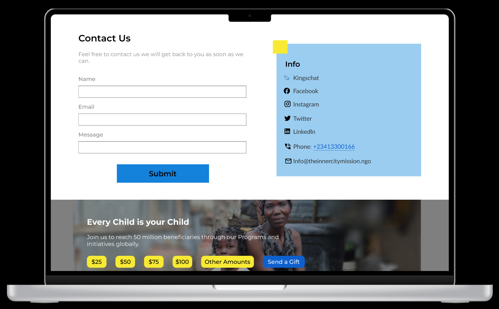](https://www.figma.com/proto/j5puqVq9j5d346UyF6dik9/Contact-Us-page?node-id=1-2&scaling=scale-down&hide-ui=1&t=9Sjk1EAopHvHVEBF-8)

**Technologies/Tools Used:**

- Figma: Utilized for creating interactive prototypes and gathering feedback during the design process.
- FontAwesome: Used for incorporating icons on the Contact Us page.

**Implementation:** 

The Contact Us mockup was implemented in [theinnercitymission.ngo/contact-us](https://theinnercitymission.ngo/contact-us), which is the Contact Us page of the InnerCity Mission website.

 

<!-- --- 
   -->

### [Send Portions Page](https://www.figma.com/file/kkovLBCSfdaXcxsNnr5Svq)

**Description**

The Send Portions page showcases a thoughtfully designed UI/UX interface that aims to make a significant impact in alleviating poverty during the Christmas season. Through visually appealing elements and intuitive navigation, the design effectively communicates the mission of the InnerCity Mission NGO to provide a memorable Christmas for indigent children worldwide. The sponsorship opportunities are presented in a clear and compelling manner, allowing visitors to choose from a range of options to support the cause. 

**Technologies/Tools Used:**

- Figma: Utilized for creating interactive prototypes and gathering feedback during the design process.
- Adobe Photoshop: Used for editing and optimizing images used in the popup.

+ Landing Page for Desktop

[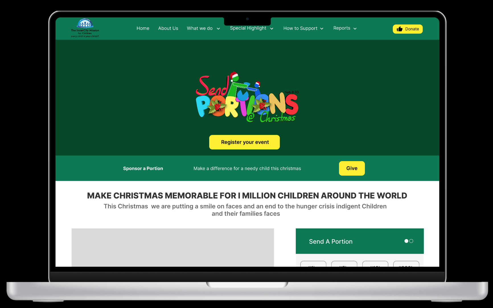](https://www.figma.com/proto/kkovLBCSfdaXcxsNnr5Svq/Send-Portions-page?node-id=1-2&scaling=scale-down&hide-ui=1&t=kmmBCvlWSiyiiqDF-8)

+ Landing Page for Mobile

 
+ Registration Form Mockup

[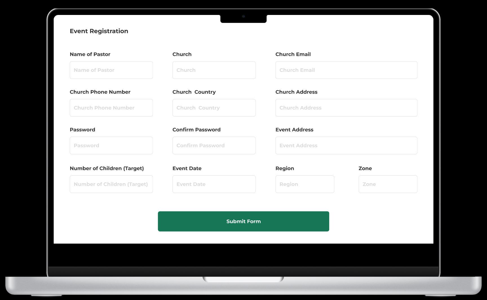](https://www.figma.com/proto/oV77Wofx6r8hKg3dqwjhVx/Send-Portions-Reg-Form?node-id=1-4&scaling=contain&hide-ui=1&t=nz9piXiOEOborWyS-8)

**Implementation:** 

The Send Portions page was implemented in [theinnercitymission.ngo/sendportions](https://theinnercitymission.ngo/sendportions) while the registration form is at [sendportions.theinnercitymission.ngo/register](https://sendportions.theinnercitymission.ngo/register).

 

### [W.A.P Super Admin Complete Dashboard Flow](https://www.figma.com/file/NC5lnXyDr6Bui5Gp1iAK2Q/)

**Description**

I contributed to the design of the W.A.P Super Admin Complete Dashboard Flow, a central platform for WATCH Ambassadors to manage and monitor their campaigns. This super admin dashboard offers features such as creating campaigns, generating custom shareable links, and tracking givings & donations made through these links. The goal of the design was to provide a comprehensive and user-friendly interface that enables efficient campaign management and accurate monitoring of giving activities. 

This was a collaborative project with [Peace Adenekan](https://www.linkedin.com/in/peacevisuals/).

**Technologies/Tools Used:**

- Figma: Utilized for creating interactive prototypes and gathering feedback during the design process.
- Adobe Photoshop: Used for editing and optimizing images used in the popup.

[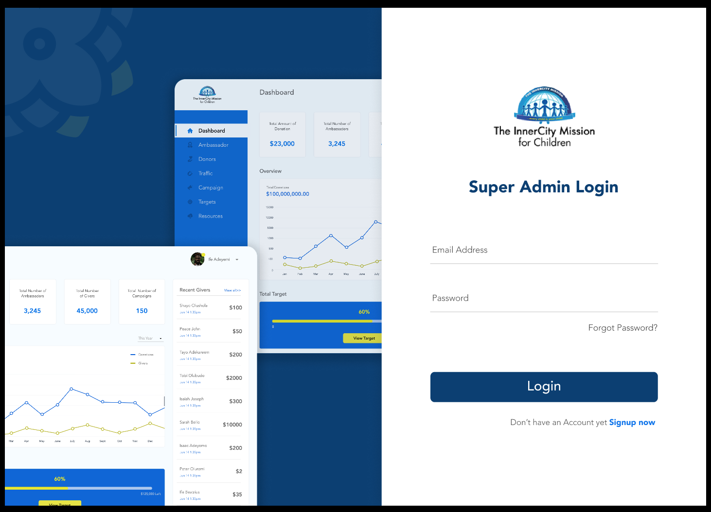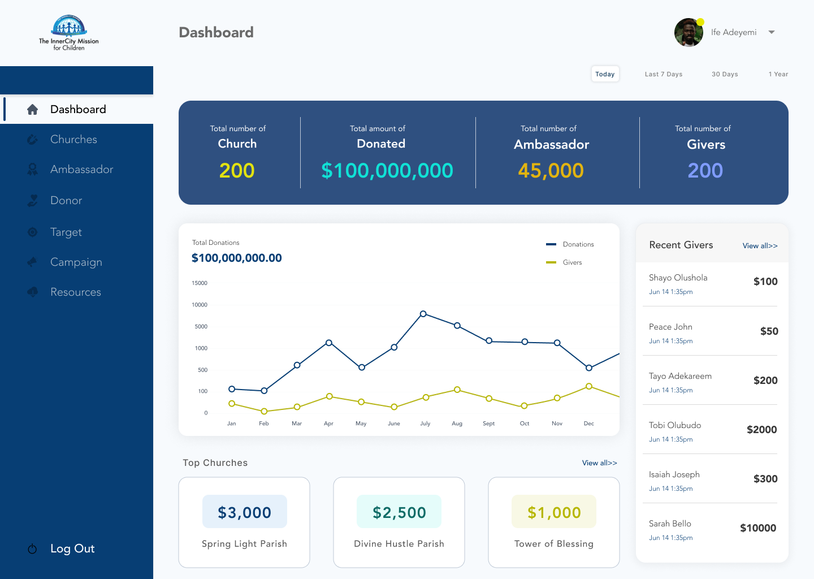](https://www.figma.com/proto/NC5lnXyDr6Bui5Gp1iAK2Q/WAP?node-id=10-4553&starting-point-node-id=10%3A4553&scaling=scale-down&hide-ui=1&t=9w3By8bkvvQ0MOki-8)

**Implementation:** 

The WAP project page was implemented in [wap.theinnercitymission.ngo](https://wap.theinnercitymission.ngo/).

  

### [Praying for the Needy Login Screen](https://www.figma.com/file/XCSFxAn2UFPlnxiibM2t72)

**Description**

I revamped the existing design of the "Praying for the Needy" login screen by making a user-friendly interface with a clean and modern design aesthetic. The harmonious color scheme, legible typography, and intuitive layout create a seamless and visually appealing experience for users.

**Technologies/Tools Used:**

- Figma: Utilized for creating interactive prototypes and gathering feedback during the design process.

[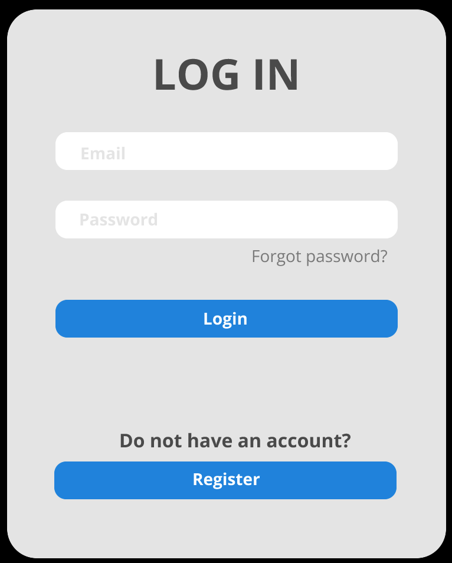](https://www.figma.com/proto/XCSFxAn2UFPlnxiibM2t72/Praying-for-the-needy-Log-in?type=design&node-id=1-2&t=2ognaGJFpHMO6jXA-8&scaling=scale-down&hide-ui=1)

**Implementation:** 

The login page was implemented in [prayer.theinnercitymission.ngo](https://prayer.theinnercitymission.ngo/).

 

### Colouring Dreams Conference (CDCON)
+ [Version 1.0](https://www.figma.com/file/DtDb6jbw7fLjArrdpwDvYq)
+ [Version 2.0](https://www.figma.com/file/x2YTKKqBMlCtLcuRoUV80X)

**Description**

I designed the UI for the Colouring Dreams Conference (CDCON), a significant global event that unites partners and stakeholders of the InnerCity Mission. This interactive prototype showcases the evolution of the conference's user interface through Version 1.0 and Version 2.0. 

The CDCON aims to bring together individuals from the global network to contribute to the organization's mission of providing support and making a positive impact on the lives of underprivileged communities. The UI/UX design ensures a seamless and engaging user experience, allowing participants to easily navigate through the conference's information and registration process.

**Technologies/Tools Used:**

- Figma: Utilized for creating interactive prototypes and gathering feedback during the design process.

[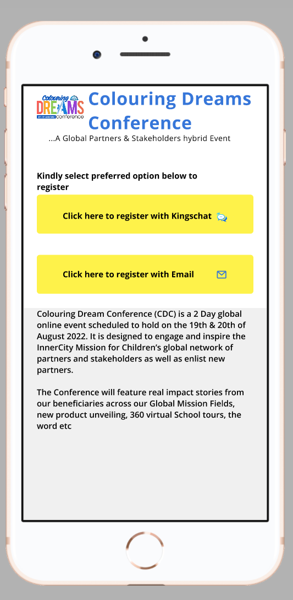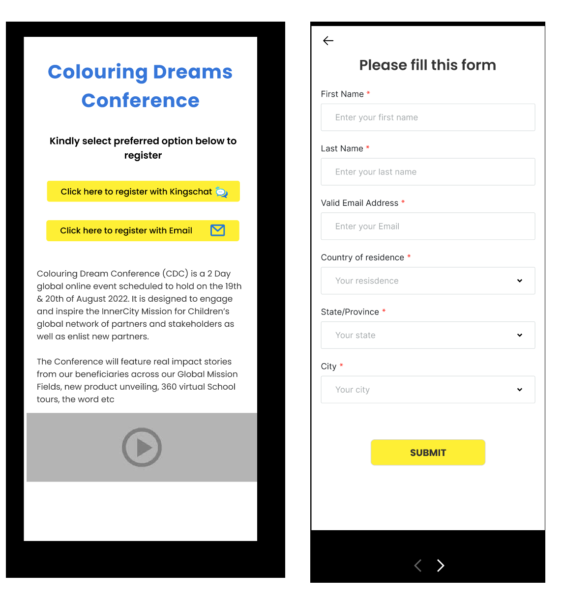](https://www.figma.com/proto/DtDb6jbw7fLjArrdpwDvYq/CDC?node-id=1-2&starting-point-node-id=1%3A2&scaling=scale-down)

**Implementation:** 

The CDCON design was implemented in [theinnercitymission.ngo/cdcon](https://theinnercitymission.ngo/cdcon).

Please note that the page has undergone several changes since its initial implementation, reflecting continuous improvements and enhancements to optimize user engagement and interaction.

## Experience

- UI/UX Designer at [The InnerCity Mission for Children](https://theinnercitymission.ngo) - 2020 - Date

## Contact Me

- Email: [sylvesterjoannaunyii@gmail.com](mailto:sylvesterjoannaunyii@gmail.com)
- LinkedIn: [Joanna Sylvester](https://www.linkedin.com/in/joanna-sylvester)

<!-- f
## What's in it for me?

By hiring me, you can expect a dedicated UI/UX Designer who is proficient in design tools such as Sketch, Figma, and Adobe XD. I have experience in conducting user research, usability testing, and implementing user-centered design processes. With my strong portfolio and understanding of design principles, I am confident in delivering visually compelling graphics and assets for promotional materials. Additionally, I am eager to contribute to a collaborative work environment, grow professionally, and seize opportunities for advancement.

-->
